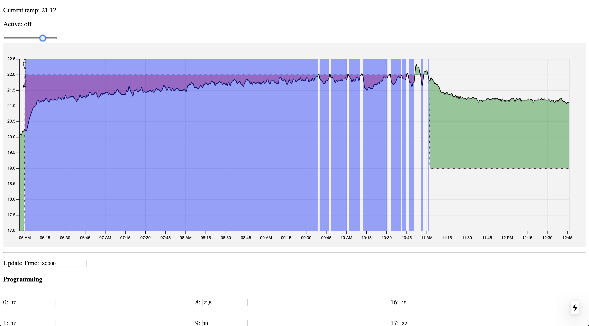

# termostato
Very crude, but still works.



### Architecture

- **iot-gateway:** Node.js server, with thermostat engine, HTTP API and redis logging logic
- **link-device-common:** generic C++ firmware for ESP8266
- **web:** Next.js web interface, with stats, charts and programming

### Usage

You can use **docker-compose** to set up the environment:

```bash
git clone https://github.com/giulioz/termostato.git
cd termostato
docker-compose build
docker-compose up -d
```

Remember that this wasn't built to be hosted everywhere, there may be customizations, hacks or absolute URLs everywhere.

